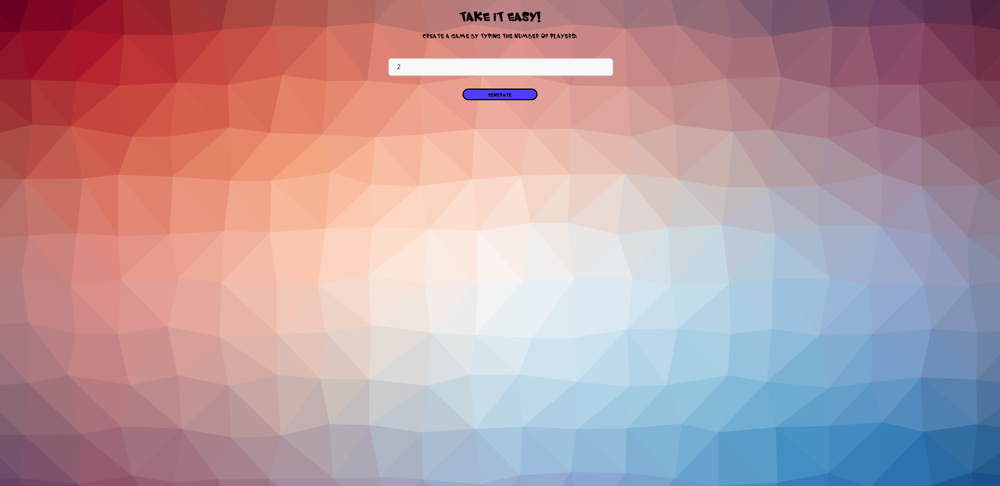
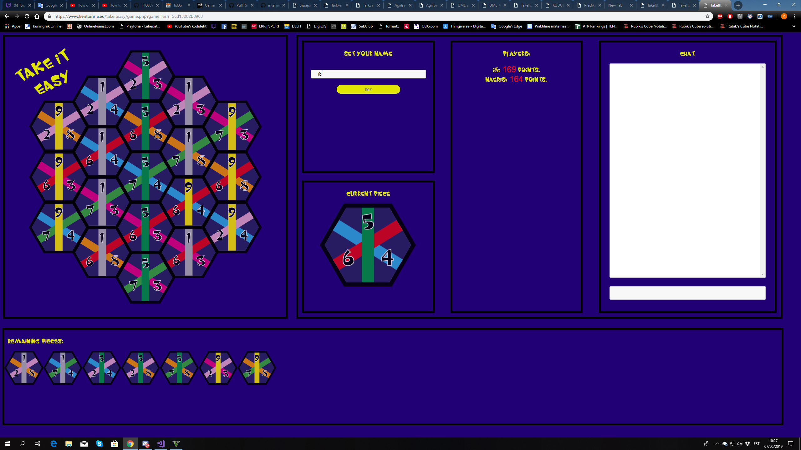
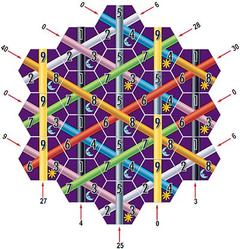

<h1>Iseseisev projekt</h1>

Autorid: Kent Pirma ja Kaspar Rasmus Eelmaa

Projektiks valisime lauamängust "Take it Easy" digitaalse versiooni tegemise. Mängu saab mängida veebis. Mängutoa tegemisel luuakse unikaalne url, kuhu peavad kõik mängijad sisenema. Kui kõik mängijad on oma nime sisestanud, hakkab mäng pihta. 
Mängu eesmärgiks on luua võimalikult palju sama värviga ridu. Iga rida peab algama ühest mängulaua otsast ning lõppema teises otsas. Vastavalt rea värvile antakse punkte. Näiteks kui saada 3 kollast (kollane annab 9 punkti) klotsi ritta, siis antakse mängijale 27 punkti. 
Võidab kõrgeima punktisummaga mängija. Kõikidel mängijatel on võimalik lehe paremas servas kasutada ka chati.

Punktide arvestamise näide:

